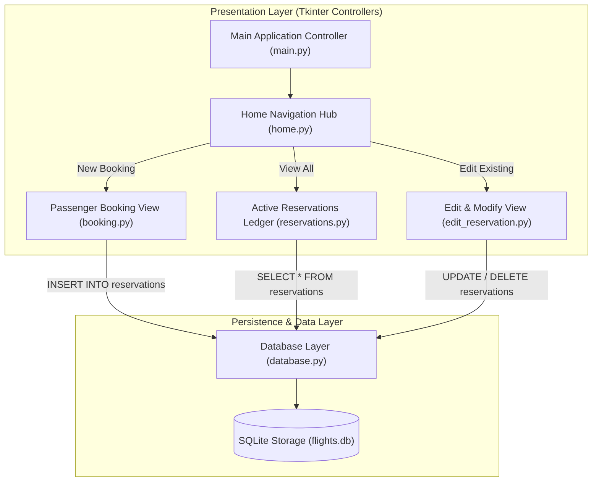

<br/><br/>

<!-- Animated Title -->
<p align="center">
  <a href="#">
    
  </a>
</p>

<p align="center">
  <b>Comprehensive Desktop Flight Reservation & Passenger Management System</b><br/>
  <i>Modular Tkinter Interface · Relational SQLite Persistence · Full Reservation Lifecycle Management · Portable Binary Distribution</i>
</p>

<br/>

<!-- Badges Row 1: Core Technologies -->
<p align="center">
  
  
  
  
  
</p>

<!-- Badges Row 2: Standards & Status -->
<p align="center">
  
  
  
</p>

<br/>

<!-- Quick Navigation Bar -->
<p align="center">
  <a href="#-overview"></a>
  &nbsp;
  <a href="#-problem-statement--desktop-solution"></a>
  &nbsp;
  <a href="#-core-capabilities"></a>
  &nbsp;
  <a href="#%EF%B8%8F-system-architecture"></a>
  &nbsp;
  <a href="#-database-schema"></a>
  &nbsp;
  <a href="#-quickstart--execution"></a>
</p>

---

## 📌 Overview

**Flight Reservation Desktop App** is a responsive desktop software suite designed for airline ticketing agents, travel desk coordinators, and administrative operators. Built with native **Python and Tkinter**, the application delivers a self-contained, offline-first passenger booking and flight management interface backed by an embedded **SQLite relational database**.

The application eliminates administrative friction through an intuitive multi-window workflow:
- **Instant Flight Booking**: Captures passenger identities, flight codes, origin/destination routes, scheduled travel dates, and seat assignments.
- **Dynamic Ledger & History**: Real-time browsing and querying of all confirmed bookings.
- **Reservation Modification & Cancellation**: On-the-fly seat reassignments, schedule adjustments, or passenger record updates with instant database synchronization.
- **Pre-Compiled Portable Distribution**: Bundled with a compiled standalone Windows `.exe` allowing zero-dependency execution on any Windows workstation without installing Python or third-party packages.

```
                  ┌────────────────────────────────────────────────────────┐
                  │          Flight Reservation Desktop Engine             │
                  │                                                        │
[ User Input /  ]─┼──> [ Tkinter Navigation Coordinator ]                  ├──> [ Confirmed Booking ]
[ UI Event Form ] │             │                                          │    - Seat Assignment
                  │             ▼                                          │    - flights.db Record
                  │    [ Schema Validation & Route Logic ]                 │    - Active Ticket Audit
                  │             │                                          │    - Real-Time Modifications
                  │             ▼                                          │
                  │    [ SQLite3 Engine (flights.db) ] ──> CRUD Operations │
                  └────────────────────────────────────────────────────────┘
```

---

## 🎯 Problem Statement & Desktop Solution

<table>
<tr>
<td width="50%" valign="top">

### ❌ The Desktop Reservation Challenge

Ticketing desks and local flight terminals often grapple with operational hurdles:

- 🌐 **Web Dependency & Latency**: Cloud-only ticketing platforms fail during network outages or bandwidth throttles.
- 📦 **Complex Environment Setup**: Standard Python tools require users to install runtimes, virtual environments, and pip packages.
- 📋 **Fragmented Paper/Spreadsheet Records**: Manual tracking leads to double-booked seats and lost ticket revisions.
- 💻 **Heavy System Footprint**: Bloated enterprise ticketing software consumes excessive memory on legacy counter machines.

</td>
<td width="50%" valign="top">

### ✅ The Flight Reservation Solution

| Challenge | Desktop Solution |
| :--- | :--- |
| **Offline Reliability** | **Zero-Network SQLite3**: Runs completely local with instantaneous transactional persistence. |
| **Portable Distribution** | **Standalone Windows `.exe`**: One-click double-clickable binary with zero prerequisites. |
| **Integrity Guarantees** | **Relational Schema**: Auto-incrementing primary key tracking passenger names, flights, and dates. |
| **Lightweight Footprint** | Native **Tkinter**: Launches in under a second with $<30\text{MB}$ RAM consumption. |

</td>
</tr>
</table>

---

## 🔥 Core Capabilities

<table>
<tr>
<td width="33%" align="center" valign="top">

### 🎫 Booking Lifecycle
<br/>
<b>Complete Ticket Management</b>
<p align="left">
• Full passenger name recording<br/>
• Flight number verification<br/>
• Origin & destination airports<br/>
• Date & seat allocation<br/>
• Immediate database commit
</p>

</td>
<td width="33%" align="center" valign="top">

### 🔍 Ledger & Search
<br/>
<b>Audit & Record Inspection</b>
<p align="left">
• Chronological reservation lists<br/>
• Passenger identity verification<br/>
• Flight manifest oversight<br/>
• Clean tabular view formatting<br/>
• Fast SQLite indexed lookups
</p>

</td>
<td width="33%" align="center" valign="top">

### ✏️ Editing & Canceling
<br/>
<b>Dynamic Record Updates</b>
<p align="left">
• Modify existing ticket details<br/>
• Seat reallocation on the fly<br/>
• Schedule & destination updates<br/>
• Safe booking cancellation<br/>
• Transactional consistency
</p>

</td>
</tr>
</table>

---

## 🏗️ System Architecture

The application is engineered using clean **Object-Oriented Programming (OOP)** patterns with decoupled view controllers and a dedicated database abstraction layer.



---

## 🗄️ Database Schema

The underlying SQLite database (`flights.db`) maintains a single normalized table with transactional integrity:

```sql
CREATE TABLE IF NOT EXISTS reservations (
    id INTEGER PRIMARY KEY AUTOINCREMENT,
    name TEXT NOT NULL,
    flight_number TEXT NOT NULL,
    departure TEXT NOT NULL,
    destination TEXT NOT NULL,
    date TEXT NOT NULL,
    seat_number TEXT NOT NULL
);
```

| Field Name | Type | Constraints | Description |
| :--- | :--- | :--- | :--- |
| `id` | `INTEGER` | `PRIMARY KEY AUTOINCREMENT` | Unique identifier assigned to each reservation |
| `name` | `TEXT` | `NOT NULL` | Full legal passenger name |
| `flight_number` | `TEXT` | `NOT NULL` | Airline carrier flight code (e.g., `MS-777`) |
| `departure` | `TEXT` | `NOT NULL` | Origin city or departure airport code |
| `destination` | `TEXT` | `NOT NULL` | Target arrival city or destination airport code |
| `date` | `TEXT` | `NOT NULL` | Scheduled date of departure |
| `seat_number` | `TEXT` | `NOT NULL` | Allocated cabin seat designation (e.g., `14A`) |

---

## 📁 Repository Structure

```
Flight-Reservation-Desktop-App/
├── 📄 Flight Reservation Desktop App.exe # Pre-compiled standalone Windows executable
├── 📄 main.py                          # Master application lifecycle & window coordinator
├── 📄 home.py                          # Main navigation dashboard
├── 📄 booking.py                       # Booking form view & passenger data entry
├── 📄 reservations.py                  # Active bookings list & ticket ledger view
├── 📄 edit_reservation.py              # Record search, modification & cancellation handler
├── 📄 database.py                      # SQLite3 database connection & table initialization
├── 📄 requirements.txt                 # Python runtime dependencies
└── 📄 README.md                        # Documentation
```

---

## 🚀 Quickstart & Execution

### Option 1: Standalone Portable Binary (Zero Setup)
Simply double-click the included executable:
```
Flight Reservation Desktop App.exe
```
*No Python installation or dependency download required.*

---

### Option 2: Running from Source Code

#### Prerequisites
- **Python**: 3.10 or higher
- **Tkinter**: Included by default in standard Python distributions

```bash
# 1. Clone repository
git clone https://github.com/IbrahimAbdelsattar/Flight-Reservation-Desktop-App.git
cd Flight-Reservation-Desktop-App

# 2. Run application
python main.py
```

---

## 👥 Author & Connect

**Ibrahim Abdelsattar**  
*AI Engineer & Software Developer*

- 🌐 **GitHub**: [@IbrahimAbdelsattar](https://github.com/IbrahimAbdelsattar)
- 💼 **LinkedIn**: [Ibrahim Abdelsattar](https://www.linkedin.com/in/ibrahim-abdelsattar/)
- 📧 **Email**: [ibrahimabdelsattar042@gmail.com](mailto:ibrahimabdelsattar042@gmail.com)

---

<p align="center">
  <sub>Built for reliable desktop workflow automation & passenger ticketing. © 2026 Flight Reservation System.</sub>
</p>
